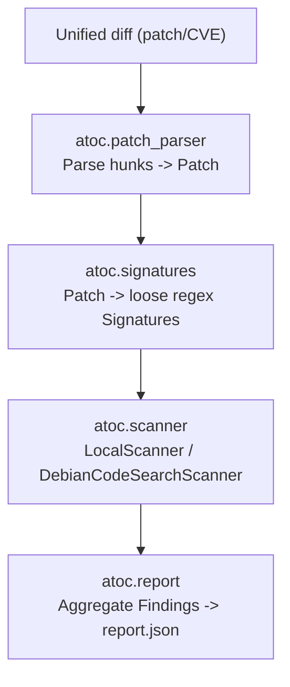

# Attack Of The Clones (AOTC)

> Fight Back Using Code Duplication Detection from Security Patches
> AI-assist used to create wiki and certain test cases

---

## 1. What this is

**AOTC** is a research prototype for a simple idea:

1. take a security patch
2. extract the vulnerable side of the change
3. turn that into a loose regex signature
4. scan other codebases for code that still looks like the vulnerable version
5. report possible code clones that need human review

This is **not** a vulnerability verifier. It is a **clone finder** and a
**triage helper**. A match means:

> "this looks similar enough to the vulnerable pattern that a human should inspect it"

not:

> "this is definitely vulnerable"

For the full research context, module-by-module internals, and design
rationale, see the **[project wiki](wiki/Home.md)**. This README is a
quickstart and map of the repository.

---

## 2. Why this exists

Vulnerable code does not always live in just one place. The same logic gets
copied, adapted, or embedded across multiple packages, which creates a
distribution-wide problem:

- one upstream project fixes a bug
- another package still contains copied vulnerable logic
- the fix does not automatically propagate
- security teams have to go find the other copies manually

This prototype explores whether a patch can be used as the starting point
for that search, using only the Python standard library plus `requests`
for the optional network-backed scanner.

---

## 3. Architecture

The project is a small, testable Python package (`atoc/`) with a thin CLI
entry point (`main.py`). Each stage of the pipeline is an independent,
unit-tested module built around typed `dataclasses` rather than loose
dicts, so a `Patch` or a `Finding` is a real type with a fixed shape
instead of "whatever keys happened to get set."



| Module                 | Responsibility                                                                                                                 |
| ---------------------- | ------------------------------------------------------------------------------------------------------------------------------ |
| `atoc/models.py`       | `Hunk`, `Patch`, `Signature`, `Finding` dataclasses shared by every stage                                                      |
| `atoc/patch_parser.py` | Parses a unified diff into a `Patch` (removed/added/context lines per hunk)                                                    |
| `atoc/signatures.py`   | Turns removed lines into loose regex `Signature` objects (identifier/number abstraction, multi-line joins, confidence scoring) |
| `atoc/scanner.py`      | `LocalScanner` walks local source trees; `DebianCodeSearchScanner` queries codesearch.debian.net                               |
| `atoc/tracker.py`      | `CveTracker` loads a local JSON file mapping CVE IDs to patches (`--cve` mode)                                                 |
| `atoc/report.py`       | Formats findings for the terminal and writes `report.json`                                                                     |
| `atoc/cli.py`          | `argparse`-based CLI wiring the above stages together                                                                          |
| `main.py`              | Thin executable entry point (`python3 main.py ...`)                                                                            |

See **[wiki/Architecture.md](wiki/Architecture.md)** for the data model in
detail and **[wiki/Signature-Generation.md](wiki/Signature-Generation.md)**
for how removed patch lines become regexes.

---

## 4. Repository layout

```text
.
├── main.py                # CLI entry point
├── atoc/                  # the package
│   ├── models.py
│   ├── patch_parser.py
│   ├── signatures.py
│   ├── scanner.py
│   ├── tracker.py
│   ├── report.py
│   └── cli.py
├── tests/                 # pytest suite, one file per module
├── samples/
│   ├── patch.diff
│   ├── curl.diff
│   └── tracker.json
├── wiki/                  # project wiki source (see below)
├── pyproject.toml
├── requirements.txt
├── curl/ coreutils/ openssh/ openssl/   # local clones used for experimentation
└── report.json            # generated output (gitignored)
```

---

## 5. Installation

```bash
python3 -m venv .venv && source .venv/bin/activate
pip install -r requirements.txt        # runtime: requests
pip install -r requirements-dev.txt    # + pytest, for running the test suite
```

Requires Python 3.10+ (the codebase uses `from __future__ import annotations`
and PEP 604 union types).

---

## 6. How to run it

### 6.1 Run the simple local patch scan

```bash
python3 main.py --patch samples/patch.diff
```

Uses the sample `strcpy -> memcpy` patch and scans the default package
directories (`curl/`, `coreutils/`, `openssh/`, `openssl/` — whichever
exist locally).

### 6.2 Run the built-in demo

```bash
python3 main.py --demo
```

Prints the generated signatures and example codesearch.debian.net URLs,
without touching any local source trees.

### 6.3 Scan selected targets only

```bash
python3 main.py --patch samples/patch.diff \
  --target curl=./curl \
  --target openssl=./openssl
```

`--target` accepts either `name=path` or just `path` (repeatable).

### 6.4 Run local CVE mode

```bash
python3 main.py --cve CVE-TEST-0001 --tracker-file samples/tracker.json
```

Add `--dcs` to query codesearch.debian.net instead of local trees (reads
`DCS_API_KEY` from the environment if set).

Tracker format:

```json
[
  {
    "cve": "CVE-TEST-0001",
    "package": "demo-package",
    "patch": "samples/patch.diff"
  }
]
```

Inline patch content is also accepted instead of a file path — see
`samples/tracker.json` for a worked example.

---

## 7. Testing

```bash
pytest
```

Every pipeline stage has a dedicated test module under `tests/`: diff
parsing edge cases, regex loosening/trigram filtering, a scan against a
temporary source tree with both a vulnerable and a fixed file, and tracker
loading in each supported JSON shape. See
**[wiki/Testing.md](wiki/Testing.md)** for what each test asserts and why.

---

## 8. Example output

```bash
python3 main.py --patch samples/patch.diff
```

```text
Removed: ['strcpy(dest, src);']
Added:   ['memcpy(dest, src, strlen(src) + 1);']

Generated 1 signature(s)

=== openssl ===
  matches: 9, potential clones: 9
  ./openssl/crypto/s390xcap.c:499 [medium] strcpy(buff, env);
  ./openssl/crypto/LPdir_win.c:158 [medium] strcpy(buf, directory);
  ...
```

That means one vulnerable-side signature was generated, and the scanner
found similar `strcpy(...)` usage in `openssl` — candidates for inspection,
not confirmed vulnerabilities.

Results are also written to `report.json`. Each entry contains `file`,
`line`, `match`, `confidence`, `fix_present`, and (in `--cve` mode)
`package`.

---

## 9. Current limitations

This is still an early research prototype, so false positives are
expected:

- lexical similarity is not semantic equivalence — safe uses can still match
- add-only patches produce no usable vulnerable signature
- fix-present detection is a nearby-text heuristic, not a real diff/AST check
- there is no ranking model beyond the `low`/`medium`/`high` confidence labels
- Debian tracker ingestion is local-file-only; there is no live sync yet

See **[wiki/Limitations-and-Roadmap.md](wiki/Limitations-and-Roadmap.md)**
for the fuller list and what's planned next.
