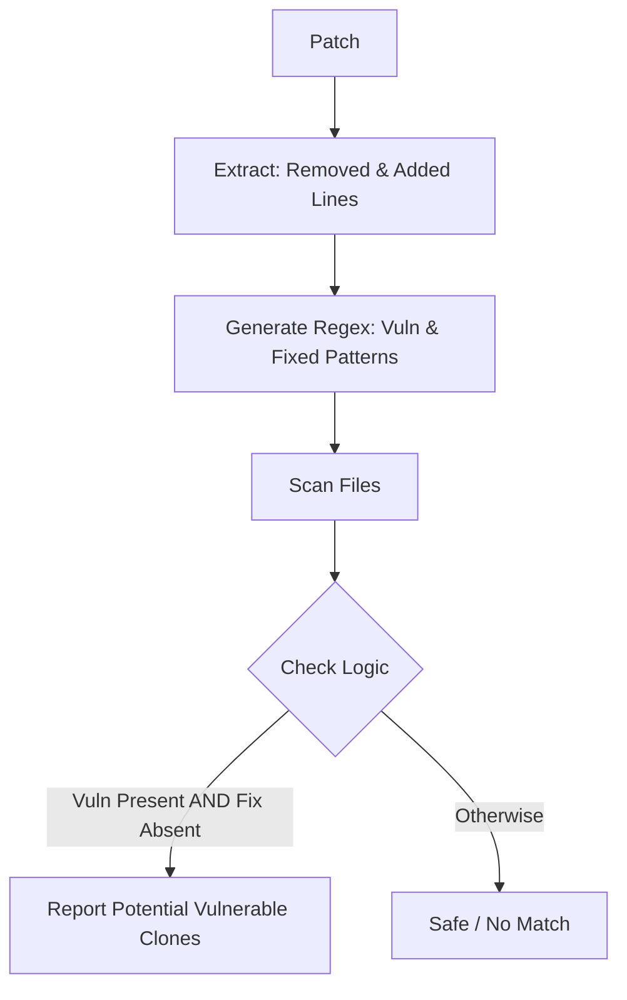

# Attack Of The Clones

> Fight Back Using Code Duplication Detection from Security Patches

---

## Description
The clone attack where identical copies of vulnerable code are embedded across multiple executables is a distribution wide security problem. The current approach necessitates extensive tracking of code duplication and individual patching or recompiling of each affected binary, significantly increasing the complexity and overhead of security updates. As a result, ensuring timely remediation across all instances of the code becomes challenging, leaving systems more susceptible to prolonged exposure to vulnerabilities.

The goal of this project is to automate the detection of code duplication in the archive by using security patches, converting these patches into loose regex patterns, and then scanning the archive for security‑related code duplication.

---

## Application tasks

- Extract patch metadata from debian security tracker. May need to standardization of patch annotation and writing a custom parser
- Research way to transform patch to loosely code signature using limited regex (re2) that could be used by codesearch.debian.net
- Use codesearch.debian.net to find code duplication in the archive
- write report about attack of clone found 

---

## Approach

For purposes of this prototype I shall be using a _classic_ unsafe pattern:

```diff
- strcpy(buffer, input);
+ strncpy(buffer, input, size);
```

Although nothing is _techincally_ wrong with this pattern usage, for this prototype it creates a sort of a _vulnerabilty_ because of its simplicity and misleading nature

> `strcpy` can be unsafe, but it is not always a vulnerability
> This pattern is derived from a patch replacing `strcpy` with `strncpy`

This regex:
    `strcpy\s*\(\s*[^,]+,\s*[^)]+\)`
will match:

1. safe uses
2. test code
3. dead code
4. already patched code

### Flow


