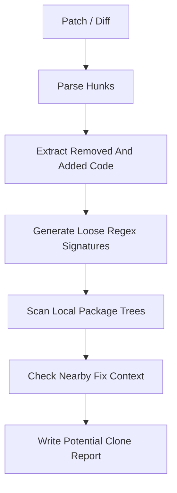

# Attack Of The Clones

> Fight Back Using Code Duplication Detection from Security Patches

---

## 1. What this prototype is

This repository is an early proof of concept for the idea behind:

**Attack Of The Clones: Fight Back Using Code Duplication Detection from Security Patches**

The goal is simple:

1. take a security patch
2. extract the vulnerable side of the change
3. turn that into a loose regex signature
4. scan other packages for code that still looks like the vulnerable version
5. report possible code clones that may need review

This is **not** a vulnerability verifier.
It is a **clone finder** and a **triage helper**.

So if it finds a match, that means:

> "this looks similar enough to the vulnerable pattern that a human should inspect it"

not:

> "this is definitely vulnerable"

---

## 2. Why this exists

One of the hard parts of security maintenance is that vulnerable code does not always live in just one place.
Sometimes the same logic gets copied, adapted, or embedded across multiple packages.

That creates a distribution-wide problem:

- one upstream project fixes a bug
- another package still contains copied vulnerable logic
- the fix does not automatically propagate
- security teams still have to go and find the other copies manually

This prototype explores whether a patch can be used as the starting point for that search.

---

## 3. Current approach

For the local demo, the prototype uses a deliberately simple pattern:

```diff
- strcpy(dest, src);
+ memcpy(dest, src, strlen(src) + 1);
```

or in the built-in demo:

```diff
- strcpy(dest, src);
- buf[len] = 0;
+ strncpy(dest, src, maxlen - 1);
+ dest[maxlen - 1] = '\0';
```

The current pipeline is:



The idea is:

- removed lines represent the vulnerable shape
- added lines represent the fixed shape
- if the vulnerable shape is present and the fix is not nearby, flag it as a possible clone

---

## 4. What the code does today

### `patch_parser.py`

This reads a unified diff and extracts code-looking lines from each hunk.

It keeps:

- removed lines
- added lines
- basic per-hunk grouping

It tries to ignore:

- diff metadata
- comment-only lines
- empty syntax noise

### `signature.py`

This converts removed patch lines into loose regex signatures.

It currently tries to be flexible by:

- preserving strong anchors like function names
- abstracting identifiers
- abstracting numeric values
- allowing whitespace variation
- building both single-line and multi-line signatures

### `scanner.py`

This walks local package trees and scans source files for those signatures.

Right now it:

- scans `.c`, `.h`, `.cpp`, and `.py`
- skips obvious non-target directories like `tests`, `examples`, `docs`, `build`, and `vendor`
- checks whether fix-like context appears near a vulnerable match
- records file path, line number, matched line, confidence, and whether the fix seems present nearby

### `tracker.py`

This is a small local helper for `--cve` mode.

It loads a JSON tracker file and returns patch entries for a requested CVE.

This is only a local stub for now.
It is not yet a full Debian security tracker integration.

### `main.py`

This is the CLI entry point.

It supports:

- scanning a local patch file
- running the built-in demo
- running a local CVE lookup against a tracker JSON file

---

## 5. What this prototype is good at right now

- quickly testing the general idea on a few cloned source trees
- showing how removed patch lines can become search patterns
- producing a small machine-readable report
- surfacing obvious copied unsafe patterns like `strcpy(...)`

---

## 6. What this prototype is not good at yet

This is still an early prototype, so false positives are expected.

The current weak spots are:

- regexes can still become too broad
- lexical similarity is not semantic equivalence
- safe uses can still match
- add-only patches do not produce useful vulnerable signatures
- fix detection is only a nearby-text heuristic
- there is no ranking model beyond simple confidence labels
- there is no automatic Debian tracker ingestion yet

So the output should be read as:

> "possible clone candidates for review"

not:

> "confirmed affected packages"

---

## 7. Repository layout

```text
.
├── main.py
├── patch_parser.py
├── signature.py
├── scanner.py
├── tracker.py
├── samples/
│   ├── patch.diff
│   └── curl.diff
├── curl/
├── coreutils/
├── openssh/
└── openssl/
```

The four package directories are local cloned codebases used for experimentation.

---

## 8. How to run it

### 8.1 Run the simple local patch scan

```bash
python3 main.py --patch samples/patch.diff
```

This uses the sample `strcpy -> memcpy` style patch and scans the default package directories.

### 8.2 Run the built-in demo

```bash
python3 main.py --demo
```

This prints the generated signatures and example codesearch URLs.

### 8.3 Scan selected targets only

```bash
python3 main.py --patch samples/patch.diff \
  --target curl=./curl \
  --target openssl=./openssl
```

You can pass either:

- `name=path`
- just `path`

### 8.4 Run local CVE mode

```bash
python3 main.py --cve CVE-TEST-0001 --tracker-file /path/to/tracker.json
```

Example tracker format:

```json
[
  {
    "cve": "CVE-TEST-0001",
    "package": "demo-package",
    "patch": "samples/patch.diff"
  }
]
```

You can also provide inline patch content instead of a file path:

```json
[
  {
    "cve": "CVE-TEST-0001",
    "package": "demo-package",
    "content": "--- a/a.c\n+++ b/a.c\n@@\n- strcpy(dest, src);\n+ memcpy(dest, src, strlen(src) + 1);\n"
  }
]
```

---

## 9. Example output

For:

```bash
python3 main.py --patch samples/patch.diff
```

you may see output like:

```text
Removed: ['strcpy(dest, src);']
Added:   ['memcpy(dest, src, strlen(src) + 1);']

Generated 1 signatures

=== openssl ===
  matches: 9, potential clones: 9
  ./openssl/crypto/s390xcap.c:499 [medium] strcpy(buff, env);
  ./openssl/crypto/LPdir_win.c:158 [medium] strcpy(buf, directory);
  ...
```

This means:

- one vulnerable-side signature was generated
- the scanner found similar `strcpy(...)` usage in `openssl`
- those are candidates for inspection, not confirmed vulnerabilities

---

## 10. Notes on the sample diffs

### `samples/patch.diff`

This is the useful demo patch for local testing.
It contains a removed vulnerable-looking line and an added replacement line.

### `samples/curl.diff`

This file is currently not a good vulnerability-clone example.
It is mostly an add-only patch, so there is no meaningful removed vulnerable side to mine.

As a result, the tool currently produces:

- removed lines: empty
- generated signatures: `0`

That is expected behavior for the current prototype.

---

## 11. Report output

Results are written to `report.json`.

Each entry may contain fields like:

- `file`
- `line`
- `match`
- `confidence`
- `fix_present`
- `package`

That output is meant to be easy to inspect manually or feed into a later reporting step.

---
