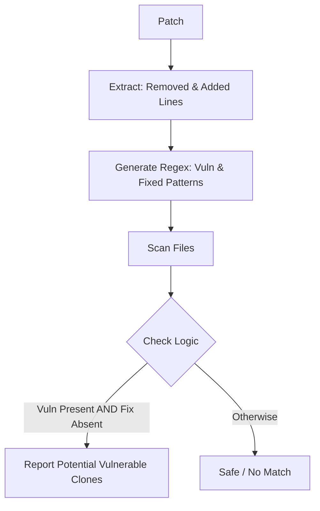

# Attack Of The Clones

> Fight Back Using Code Duplication Detection from Security Patches

---

## 1. Approach

For purposes of this prototype I shall be using a _classic_ unsafe pattern:

```diff
- strcpy(buffer, input);
+ strncpy(buffer, input, size);
```

Although nothing is _techincally_ wrong with this pattern usage, for this prototype it creates a sort of a _vulnerabilty_ because of its simplicity and misleading nature

> `strcpy` can be unsafe, but it is not always a vulnerability
> This pattern is derived from a patch replacing `strcpy` with `strncpy`

This regex:
`strcpy\s*\(\s*[^,]+,\s*[^)]+\)`
will match:

1. safe uses
2. test code
3. dead code
4. already patched code

### 3.1 Flow



---

## 2. Implementation

---

## 3. Demo

To run the application ensure the diff files are present in the `samples/` directory and then run

## 3.1 Step 1 - Patch Parsing - `patch_parser.py`

Input:

```diff
- strcpy(dest, src);
+ memcpy(dest, src, strlen(src) + 1);
```

What happens:

- this extracts code lines from the patch
- and filters out comments, junk, metadata

Output:

```python
removed = ["strcpy(dest, src);"]
added = ["memcpy(dest, src, strlen(src) + 1);"]
```

## 3.2 Step 2 - Signature Generation - `signature.py`

Takes:

```python
"strcpy(dest, src);"
```

Converts into regex:

```regex
strcpy\s*\(\s*[^,]+,\s*[^)]+\)
```

this basically makes the pattern more flexible and can match variations like:

- `strcpy(a, b)`
- `strcpy(buf, input)`

## 3.3 Step 3 - Repository Scanning - `scanner.py`

For each file in:

1. `curl`
2. `coreutils`

The Program:

1. Opens the file
2. Applies regex
3. Finds matches
4. Records:
   - file path
   - line number
   - matched code

## Output

- execute `python3 ./main.py`

```
=== Parsing Patch ===

Removed (pattern source):
 - strcpy(dest, src);

Added (context/fix):
 + memcpy(dest, src, strlen(src) + 1);

Generated Regex Patterns:
  strcpy\s*\(\s*[^,]+\s*,\s*[^,]+\s*\)

=== Scanning curl ===
Found 0 matches

=== Scanning coreutils ===
Found 11 matches
./coreutils/src/ls.c:1354 -> strcpy (abmon[i], abbr)
./coreutils/src/numfmt.c:806 -> strcpy (pfmt, ".*Lf%s")
./coreutils/src/numfmt.c:851 -> strcpy (pfmt, ".*Lf%s%s%s%s")
./coreutils/src/who.c:393 -> strcpy (stpcpy (p, display)
./coreutils/src/who.c:405 -> strcpy (stpcpy (p, host)

Saving report.json...

Done.
```

- contents of `report.json`

```json
{
  "curl": [],
  "coreutils": [
    {
      "file": "./coreutils/src/ls.c",
      "line": 1354,
      "match": "strcpy (abmon[i], abbr)"
    },
    {
      "file": "./coreutils/src/numfmt.c",
      "line": 806,
      "match": "strcpy (pfmt, \".*Lf%s\")"
    },
    ...
    {
      "file": "./coreutils/src/stat.c",
      "line": 851,
      "match": "strcpy (pformat + prefix_len, \"s\")"
    },
    {
      "file": "./coreutils/src/ln.c",
      "line": 359,
      "match": "strcpy (backup + destdirlen, backup_base)"
    }
  ]
}
```
