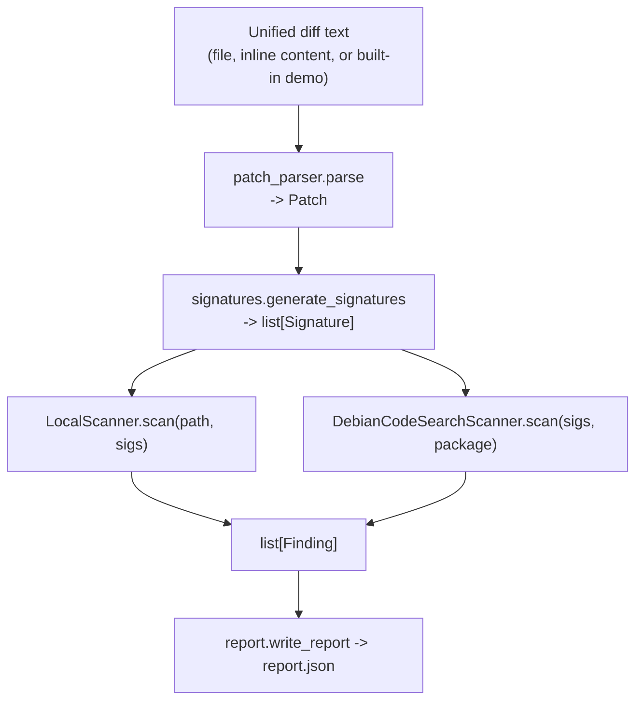

# Architecture

## Layout

```text
atoc/
├── models.py       # Hunk, Patch, Signature, Finding dataclasses
├── patch_parser.py # unified diff -> Patch
├── signatures.py   # Patch -> list[Signature]
├── scanner.py       # LocalScanner, DebianCodeSearchScanner
├── tracker.py       # CveTracker (local CVE -> patch lookup)
├── report.py        # terminal summaries + report.json writer
└── cli.py           # argparse wiring
main.py               # `python3 main.py ...` entry point
```

`main.py` is intentionally three lines — all behavior lives in the package
so it can be imported and unit-tested without going through `argparse` or
`sys.argv`. See `tests/test_cli.py` for exactly that: it calls
`atoc.cli.run_local` / `run_cve` / `run_demo` directly.

## Data model (`atoc/models.py`)

Every stage passes one of these dataclasses instead of a dict with
implicit keys:

| Type        | Fields                                                              | Produced by            |
|-------------|----------------------------------------------------------------------|-------------------------|
| `Hunk`      | `removed`, `added`, `context` (all `list[str]`)                     | `patch_parser.parse`    |
| `Patch`     | `removed`, `added` (flattened across hunks), `hunks: list[Hunk]`    | `patch_parser.parse`    |
| `Signature` | `vuln` (regex), `fix` (regex or `""`), `multi: bool`, `confidence`  | `signatures.generate_signatures` |
| `Finding`   | `file`, `line`, `match`, `confidence`, `fix_present`, `package: str \| None` | `LocalScanner.scan` / `DebianCodeSearchScanner.scan` |

`Signature.to_dict()` and `Finding.to_dict()` exist only for
`report.write_report` — everywhere else in the codebase works with the
dataclass, not a dict.

## Pipeline



`atoc/cli.py` is the only module that knows about all five other modules —
everything else has a single upstream dependency (`signatures` depends on
`models`; `scanner` depends on `models`; etc.), which is what makes each
one independently testable with plain dataclass literals instead of a full
end-to-end run.

## Why dataclasses instead of dicts

The original prototype passed dicts like
`{"removed": [...], "added": [...], "hunks": [...]}` between functions.
That works, but nothing stops a typo (`patch["remvoed"]`) from silently
producing an empty list instead of raising, and nothing documents the
shape except reading every call site. Swapping in `Hunk` / `Patch` /
`Signature` / `Finding` dataclasses makes the shape explicit, gives
attribute access with typo-checking from any editor/type-checker, and lets
tests construct fixtures with `Patch(hunks=[Hunk(removed=[...])])` instead
of hand-writing nested dict literals.
